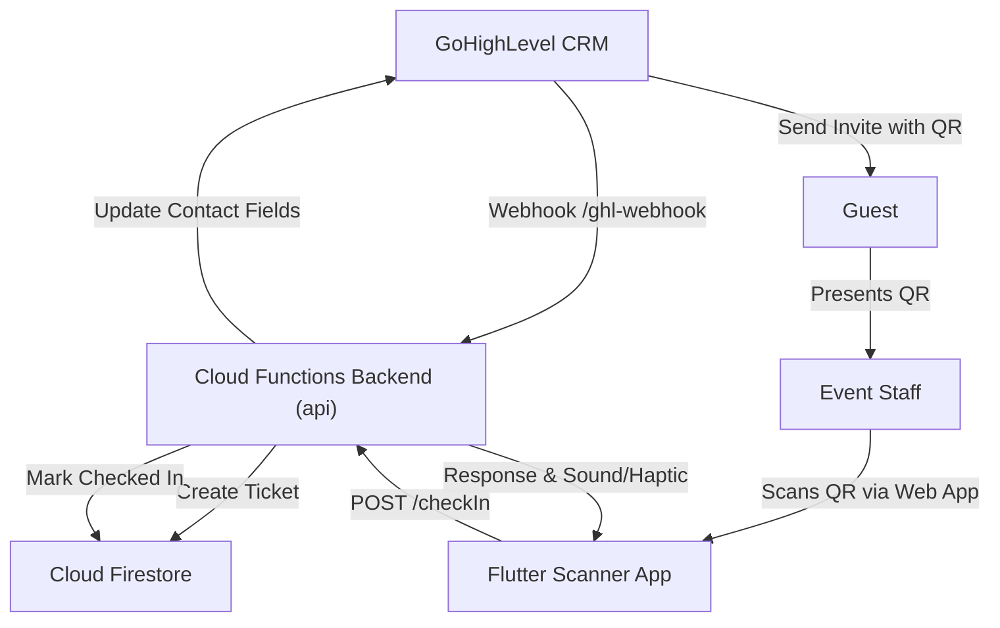

# Bouclé de Payró — Event Companion App & Management System

A custom guest list management and QR check-in system built for the invite-only **Payró – Bouclé launch event**. The system is fully deployed on the `inhaus-brain-full-prod` Firebase project.

---

## Live Links

* **Scanner Web App**: [https://boucle-scanner-inhaus.web.app](https://boucle-scanner-inhaus.web.app)
* **Cloud Function API Base**: `https://us-central1-inhaus-brain-full-prod.cloudfunctions.net/api`

---

## System Architecture



---

## 🔑 Access Passcode (Event Staff PIN)

Log in to the Web App using the PIN code:
# `4268`

---

## 📡 API Endpoints

All endpoints are hosted on the Cloud Function under the base URL:
`https://us-central1-inhaus-brain-full-prod.cloudfunctions.net/api`

### 1. `POST /ghl-webhook`
Handles ticket generation when a user is invited in GoHighLevel.
* **Payload**: GoHighLevel Contact Payload (includes email, name, phone, company, and contact ID).
* **Action**:
  1. Generates a unique Ticket ID (`BOU-XXXX-XXXX`).
  2. Generates a QR Code image URL.
  3. Saves the guest record to Firestore (`tickets` collection).
  4. Automatically updates the contact's custom fields in GoHighLevel with the Ticket ID and QR Code URL.

### 2. `POST /login`
Checks staff access PIN.
* **Payload**: `{"passcode": "4268"}`
* **Response**: `{"success": true, "token": "4268"}`

### 3. `GET /guests`
Retrieves the full list of guests, sorted alphabetically by name.
* **Headers**: `Authorization: Bearer 4268`

### 4. `POST /checkIn`
Validates a QR Code scan and processes check-in.
* **Headers**: `Authorization: Bearer 4268`
* **Payload**: `{"ticketId": "BOU-XXXX-XXXX"}`
* **Response States**:
  * `SUCCESS` — Checked in successfully (plays positive chime).
  * `ALREADY_CHECKED_IN` — Guest has already scanned (plays warning sound).
  * `NOT_FOUND` — Ticket ID is invalid (plays error buzzer).

---

## 🛠️ Project Structure

* `/functions` — Node.js Express Cloud Function handling logic and GoHighLevel integration.
* `/scanner_app` — Flutter Mobile-First Web Application for event staff scanners.
* `firebase.json` — Deployment configuration mapping hosting specifically to `boucle-scanner-inhaus` and API logic.

---

## 📈 Local Development

To run the emulators locally:
1. Run Firestore and Functions emulators:
   ```bash
   npx firebase emulators:start --only firestore,functions
   ```
2. Run the Flutter App:
   ```bash
   cd scanner_app
   flutter run -d chrome
   ```
